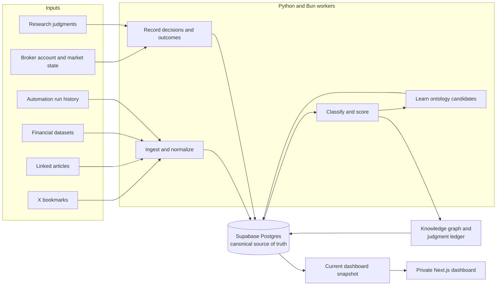

# ThesisForge

ThesisForge is a persistent research and decision system for active investing. It
turns X bookmarks, linked articles, financial data, market events, portfolio
state, and explicit research judgments into a living investment ontology: a
traceable map of sources, themes, symbols, theses, catalysts, predictions,
decisions, trades, and lessons.

The goal is not to produce another disposable market summary. ThesisForge is
designed to remember what the research process believed, why it believed it,
what would prove it wrong, what action followed, and what the outcome should
change next time.

## Intent

ThesisForge is intended to become an evidence-driven operating system for
short-horizon, catalyst-aware investing. It should help answer:

- What investable themes are emerging across otherwise disconnected sources?
- Which verified public symbols express those themes, and through what
  relationship?
- Which theses are hardening, softening, or approaching a falsifier?
- What events could reprice a thesis over the next days or weeks?
- Where does the current portfolio already carry the same exposure?
- Which proposed trades survive bull, bear, portfolio-risk, and execution
  review?
- What did prior predictions, tests, trades, and failures teach the next
  research cycle?

The repository supports research ingestion, structured judgment, ontology
learning, financial-data retention, run observability, and dashboard
publication. Live broker inspection and order placement are performed through
external Robinhood tooling during an orchestrated run; this repository defines
the policy, persistence, validation gates, and audit trail rather than embedding
broker credentials or a standalone order router.

## How the system works



The major layers are:

1. **Acquisition.** Small workers fetch private X bookmarks, readable linked
   article text, paid financial datasets, and Codex automation history. Broker
   state is refreshed by the orchestrating agent when a trading run requires
   it.
2. **Canonical storage.** Supabase Postgres is the only database and system of
   record. Raw source material, normalized facts, derived judgments, candidate
   knowledge, decisions, and outcomes remain queryable together.
3. **Ontology and judgment.** Sources become graph nodes and evidence edges.
   Themes connect to theses and verified symbols; predictions, insights,
   catalysts, event decisions, and trade proposals preserve the system's
   current point of view.
4. **Governed learning.** Repeated evidence proposes new vocabulary, theme
   memberships, and emerging themes. Strict promotion rules and a review queue
   prevent one noisy post from silently rewriting the taxonomy.
5. **Decision and feedback.** Research cycles preregister an expected outcome,
   retain test variants and adversarial scenarios, record trade or no-trade
   decisions, and turn postmortems into reusable lessons.
6. **Presentation.** A publisher composes the current state into a single
   `dashboard_snapshots` record. The private Next.js dashboard reads that
   server-side snapshot and exposes no database credentials to the browser.

## How ThesisForge self-learns

“Self-learning” here means evidence-backed updates to persistent knowledge, not
an opaque model retraining itself or changing trading rules without review.

### 1. Observe

Ingestion extracts known symbols, phrases, hashtags, and n-grams from bookmarks,
articles, and research events. Each observation is stored with its source key
and timestamp, so the learner can distinguish repeated independent evidence
from repetition inside one source.

### 2. Classify

At the start of a run, the worker loads an immutable view of the active ontology
from Postgres. Weighted terms, negative terms, verified symbol memberships, and
per-theme thresholds determine whether a source matches a theme. The resulting
score and exact matched features are written to the evidence ledger.

The classifier deliberately does not feed its own derived `thesis_symbols` back
into the active ontology. That avoids a circular loop in which a weak guess
amplifies itself merely because the system made it before.

### 3. Propose

The learner turns repeated co-occurrence into governed candidates:

- a verified symbol repeatedly associated with a theme can become a membership
  candidate;
- a distinctive phrase repeatedly associated with a theme can become a term
  candidate;
- a multi-source cluster that does not resemble an active theme can become an
  emerging-theme candidate.

Every candidate retains its supporting source records, score, source count, and
sample context. URL fragments, unverified uppercase prose, common stopwords,
and weak one-off clusters are suppressed from the default review surface.

### 4. Promote carefully

Term and membership candidates may auto-promote only after crossing the active
theme's multi-source threshold and additional quality gates. Symbol membership
requires a symbol that has already been verified; learned terms must show enough
precision across all observations. Brand-new themes remain candidates for
manual review rather than becoming active automatically.

Operators can inspect and govern the queue explicitly:

```sh
bun run ontology:learn
bun run ontology:candidates
bun run cli -- ontology verify-symbol SYMBOL
bun run cli -- ontology approve CANDIDATE_ID
bun run cli -- ontology reject CANDIDATE_ID --note "reason"
```

### 5. Learn from decisions and outcomes

Ontology growth is only one learning loop. ThesisForge also stores falsifiable
predictions, thesis stance and falsifiers, event participation decisions,
research cycles, strategy tests, stress scenarios, specialist agent views,
postmortems, and regime-tagged lessons.

The intended closed loop is:

```text
research -> preregister -> test -> stress -> decide -> act or abstain
         -> resolve outcome -> postmortem -> incorporate lesson -> research
```

Negative results and killed variants are retained. A lesson remains visible as
an open loop until it has been incorporated into a later research cycle. This
makes learning auditable: a future decision can point to the evidence and prior
failure that changed it.

## Safety and governance

ThesisForge separates learned knowledge from execution authority.

- The adaptive ontology can expand vocabulary and verified memberships, but it
  cannot rewrite `config/trade_policy.json`.
- Brand-new themes require review, and candidate evidence is never discarded
  merely because a candidate is rejected.
- Risk and sizing controls are code- and data-enforced rather than prompt-only.
- A fresh broker account snapshot and positions are required before sizing;
  stale or unavailable account state rejects the sizing attempt.
- Symbols must resolve through the broker before they are treated as tradable.
- Live placement is limited to the configured asset classes, sizing caps, buying
  power, and regular US market hours, with broker review immediately before an
  order.
- Every proposal, rejection, placement, outcome, and lesson is intended to be
  persisted in Postgres.
- The dashboard secret stays server-side. Public browser code never receives a
  Supabase secret or database connection string.

See [`config/trade_policy.json`](config/trade_policy.json) and
[`docs/live-trading-checklist.md`](docs/live-trading-checklist.md) for the
current execution contract.

## Repository layout

```text
src/thesisforge/
  bookmarks/      X bookmark normalization and evidence capture
  articles/       linked-article fetching and text extraction
  ontology/       database-backed classification, learning, graph, and review
  research/       structured judgments and event mapping
  financial/      cache-first paid financial-data vault
  reports/        thesis and durable run reports
  automations/    Codex automation/run-history indexing
  dashboard/      canonical dashboard snapshot publisher
  db/             Supabase Postgres connection adapter
scripts/x/        Bun entry points for X OAuth and bookmark retrieval
supabase/
  schemas/        declarative desired database state
  migrations/     generated migration history
web/              private Next.js dashboard
tests/            Python unit and integration-oriented tests
config/           execution policy
docs/             deeper design notes and operating runbooks
```

## Runtime and setup

- **Bun 1.4** is the JavaScript package manager and task orchestrator.
- **Python 3.11+** workers live in the installable `src/thesisforge/` package and
  run from a local `.venv`.
- **Supabase Postgres** is required; there is no SQLite or bundled local-data
  fallback for application state.
- **Next.js** in `web/` serves the private dashboard.

Install the Python package and dashboard dependencies:

```sh
bun run setup:python
cd web && bun install
```

Copy `.env.example` to `.env.local` and configure the integrations you intend to
use. At minimum, database-backed commands require:

```sh
THESISFORGE_DATABASE_URL=postgresql://...
```

The dashboard server additionally requires `SUPABASE_URL` and
`SUPABASE_SECRET_KEY`. X ingestion and paid financial-data ingestion require
their respective credentials. Do not commit `.env.local`.

This project uses Supabase declarative schemas. The desired schema lives in
`supabase/schemas/`, while `supabase/migrations/` records migration history.
After applying the schema to the target project, verify the least-privilege
worker connection:

```sh
bun run supabase:verify
```

## Common workflows

Refresh research from X through the ontology and dashboard:

```sh
bun run research:refresh
```

Inspect the core research surfaces independently:

```sh
bun run thesis:report
bun run ontology:report
bun run ontology:learn
bun run ontology:candidates
bun run dashboard:publish
```

Capture structured judgments:

```sh
bun run research:capture -- --help
bun run cli -- research capture thesis-view THESIS_ID \
  --stance bullish \
  --variant "What the market is missing" \
  --falsifier "The observation that would invalidate the thesis"
```

Inspect or populate the cache-first financial-data vault:

```sh
bun run financial:plan
bun run financial:stats
bun run financial:test
```

See [`docs/financial-data-vault.md`](docs/financial-data-vault.md) before
executing a paid fetch. The dry-run plan is the default, and paid requests have
an explicit cap.

Explore the unified command surface and run the test suite:

```sh
bun run cli -- --help
bun run test
```

## Further reading

- [`docs/ontology.md`](docs/ontology.md) — graph model, judgment model, and
  adaptive-taxonomy design
- [`docs/financial-data-vault.md`](docs/financial-data-vault.md) — raw response
  retention, normalization, and cache semantics
- [`docs/live-trading-checklist.md`](docs/live-trading-checklist.md) — broker,
  sizing, review, and persistence gates
- [`docs/scheduled-run-prompt.md`](docs/scheduled-run-prompt.md) — end-to-end
  orchestration contract for a scheduled research run

## Project status

ThesisForge is a private, evolving research system. The database schema and
workers already implement the persistent ontology, governed candidate learning,
financial-data vault, research ledger, run history, and dashboard snapshot. The
broader autonomous research-to-trade loop depends on configured external data
and broker tooling and should be treated as an auditable operating workflow,
not as a promise of investment performance.
