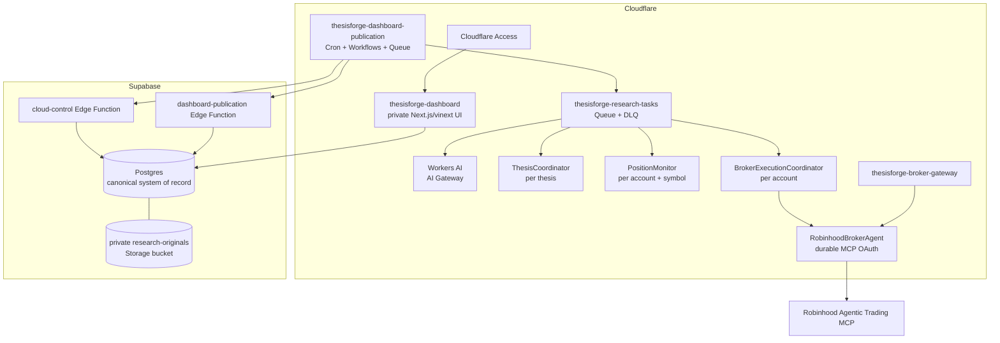

# ThesisForge

ThesisForge is a cloud-native research and autonomous equity-trading operating system. It turns source material, market data, portfolio state, explicit theses, model judgments, executions, and outcomes into a persistent, auditable decision loop.

The production research and trading path runs in Cloudflare and Supabase. It does not require Codex, a terminal session, or a powered-on laptop. Robinhood access is held by a Cloudflare Agent Durable Object through Robinhood's remote MCP endpoint.

> ThesisForge is experimental software, not a promise of investment performance. It fails closed: missing evidence, stale data, broker warnings, unavailable controls, conflicting intent, or an invalid execution window blocks an order.

## Production status

- Cloudflare Workers: private dashboard, cloud control plane, Robinhood gateway
- Supabase: canonical Postgres, Edge Functions, RLS, and private research Storage
- Autonomous equity actions: open, hold, add, reduce, and exit
- Per-order human approval: not required
- Unsupported live products: options, crypto, margin, and shorting
- Scheduled runs: 10:05, 13:05, and 15:25 America/New_York on weekdays
- Execution window: 09:45–15:45 America/New_York on weekdays

## Production architecture



Durable Object SQLite stores coordination, deduplication, and broker-connection state. It is not a second research database. Supabase remains canonical.

## Cloudflare components

| Component | Responsibility | Boundary |
|---|---|---|
| `thesisforge-dashboard` | Serves the private dashboard | Cloudflare Access; server-side Supabase reads; no service-role secret in the browser |
| `thesisforge-dashboard-publication` | Cron, Workflows, Queue producer/consumer, Workers AI, deterministic decisions | Route-less control Worker with bounded Supabase control access |
| `thesisforge-broker-gateway` | Robinhood connection and final broker enforcement | Access-protected operator UI; exact tool allowlist; OAuth state in its Agent DO |
| `CloudResearchWorkflow` | Durable scheduled orchestration | Market gate, context load, broker refresh, position reconciliation, fan-out, audit |
| `DashboardPublicationWorkflow` | Publishes shadow/current dashboard snapshots | Calls Supabase publication function and can never enable trading |
| `thesisforge-research-tasks` | Thesis research, position reviews, execution intents | Batch 5, concurrency 2, four retries, 60-second base delay, DLQ |
| Workers AI | Typed recommendations | No broker credentials, tools, or placement authority |

### Durable Objects

| Durable Object | Coordination atom | Purpose |
|---|---|---|
| `ThesisCoordinator` | Thesis ID | Deduplicates analyses and retains the latest typed result |
| `PositionMonitor` | Account key + symbol | Persists observations/action history and enforces add/reduce cooldowns |
| `BrokerExecutionCoordinator` | Agentic account key | Serializes and idempotently reserves live intents |
| `RobinhoodBrokerAgent` | Primary Robinhood connection | Restores durable MCP OAuth, reads account/market state, and enforces final order rules |

## Schedule and cost posture

Paired UTC Cron candidates preserve the New York schedule through daylight-saving changes:

```text
5 14,15 * * 1-5    -> 10:05 America/New_York
5 17,18 * * 1-5    -> 13:05 America/New_York
25 19,20 * * 1-5   -> 15:25 America/New_York
```

`marketGate` admits only the candidate matching the exact New York slot and rejects weekends, yielding three useful weekday runs rather than six. It is not a complete exchange-holiday or early-close calendar; Robinhood market state, tradability, quotes, and review remain authoritative.

Costs stay bounded through three useful wakes, thesis-input hashes that skip unchanged LLM work, at most 12 theses per run, a small structured-output Workers AI model, Queue concurrency of two, and hibernating Durable Objects. Position management does not poll every minute.

## One run, end to end

1. Cron creates one idempotent `CloudResearchWorkflow` instance for the admitted slot.
2. The Workflow registers `cloud_runs` and loads bounded canonical context through `cloud-control`.
3. `RobinhoodBrokerAgent` refreshes the Agentic account, buying power, positions, and agentic orders.
4. The snapshot is stored in `account_snapshots` and `portfolio_exposure`.
5. Broker positions reconcile into `position_episodes`; missing positions close their prior episode.
6. Unchanged thesis hashes skip unnecessary inference.
7. Queue tasks fan out thesis research and one review per open account+symbol episode.
8. Workers AI returns guided JSON; the thesis or position Durable Object deduplicates it.
9. Deterministic policy converts the recommendation into hold, open, add, reduce, exit, or no-trade.
10. An approved action becomes a `trade_proposals` row and a separate execution task.
11. Execution re-reads both Supabase kill switches, refreshes the broker, persists `trade_intents` and `broker_execution_attempts`, and enters the account coordinator.
12. The broker Agent recomputes action semantics, buying power or sellable shares, pending orders, quote age, spread, portfolio caps, and session time.
13. Robinhood `review_equity_order` runs immediately before `place_equity_order`; any `order_checks` entry blocks placement.
14. Submission, immediate fills, failures, observations, and episode transitions are persisted. Later snapshots reconcile quantities and closures.
15. The cloud run finalizes after its tasks are terminal.

## Where decisions are made

| Layer | Recommends | Authorizes | Places |
|---|---:|---:|---:|
| Workers AI | Yes | No | No |
| Deterministic TypeScript policy | Yes | Within hard rules | No |
| Supabase `risk_controls` | No | Global permit/stop | No |
| `BrokerExecutionCoordinator` | No | Serializes/reserves | No |
| `RobinhoodBrokerAgent` | No | Revalidates every broker invariant | Yes |
| Robinhood | No | Authoritative broker checks | Accepts/rejects |

Workers AI uses `@cf/meta/llama-3.1-8b-instruct-fast` through AI Gateway. It sees bounded thesis, portfolio, and broker research context. It never receives OAuth tokens, raw account numbers, or the broker tool catalog.

## Autonomous entry policy

A new position requires:

- material change and an explicit `buy` recommendation;
- a hardening bullish thesis with confidence at least 80;
- model confidence at least 85 and passing bull, bear, and portfolio-risk panels;
- a substantive catalyst and invalidation;
- a symbol linked to the thesis, with no existing position or pending same-symbol order;
- active tradability, quote age at most 120 seconds, and spread at most 80 bps;
- recent reported earnings or deterministic price/volume dislocation;
- at least $25 notional, sized 1–5%, then capped by buying power and 5% of portfolio value.

## Autonomous position management

Each reconciled position gets a scheduled typed review and a `PositionMonitor`.

### Add

- linked hardening bullish thesis, confidence at least 80;
- model confidence at least 90 and all review panels passing;
- deterministic positive evidence;
- never average down: market price must be at or above average cost;
- one add/day, two lifetime adds, and at least 24 hours between adds;
- add tranche of 1–2%; total post-add position capped at 5%;
- fresh buying power and no pending same-symbol order.

### Reduce

- model confidence at least 88;
- weakening or invalidated thesis state;
- deterministic adverse evidence, such as a negative high-volume dislocation or recent negative earnings surprise;
- one reduction/day; sell 25–50% of available shares;
- a reduction cannot silently become a full exit.

### Exit

- sell all available shares after the deterministic -8% hard-loss threshold; or
- sell all available shares when high-confidence invalidation has deterministic adverse evidence.

Risk-reducing sells bypass exhausted buy-count and buy-notional quotas. They still require the regular execution window, a fresh bid, acceptable spread, no pending same-symbol order, broker review, idempotency, and available shares.

## Broker boundary

Permitted reads:

```text
get_accounts              get_portfolio
get_equity_positions      get_equity_orders
get_equity_quotes         get_equity_tradability
get_equity_fundamentals   get_equity_historicals
get_earnings_results      search
```

Permitted writes:

```text
review_equity_order
place_equity_order
```

Options, crypto, cancellation, watchlist mutation, and unknown future tools remain blocked. Buys are dollar-based; reductions and exits are quantity-based. The gateway requires exactly one active Robinhood Agentic account and persists only a stable hashed account key plus last four digits outside the Agent.

Hard gateway ceilings include the 09:45–15:45 New York window, 120-second side-aware quotes, 80-bps spread, 5% per buy, 20% daily buy notional, three agentic buys/day, no averaging down, no pending same-symbol order, UUIDv4 idempotency, and fail-closed Robinhood review.

## Supabase data plane

| Domain | Canonical surfaces |
|---|---|
| Sources/documents | bookmarks, URLs, articles, research documents/sources/annotations, private `research-originals` bucket |
| Research ontology | symbols, theses, evidence, scores, catalysts, themes, terms, observations, candidates/actions, graph nodes/edges |
| Decision learning | research events/queue/cycles, predictions, insights, strategy tests/scenarios, agent runs, lessons, postmortems |
| Trading/audit | account snapshots, portfolio exposure, proposals, position episodes/events, intents, attempts, fills, risk controls |
| Cloud observability | `cloud_runs`, `cloud_tasks`, input hashes, prompt versions, outputs, AI Gateway log IDs |
| Publication | `dashboard_snapshots` |
| Financial vault | request cache, compressed responses, access log, normalized financial records |

`cloud-control` and `dashboard-publication` use custom SHA-256 token authentication. The service role remains inside Supabase Edge Functions. Public tables use RLS, and cloud execution tables are unavailable to `anon` and `authenticated` roles. Original files are immutable and content-addressed in private Storage; metadata and judgment remain queryable in Postgres.

## How the system learns

Learning means persistent evidence-backed memory, not hidden model retraining or self-modifying execution rules.

```text
observe -> classify -> propose ontology changes -> promote after quality gates

research -> preregister -> test -> stress -> decide -> act/abstain
-> observe fills and position state -> resolve -> postmortem
-> persist lesson -> incorporate in a later research cycle
```

The ontology learner keeps source evidence and avoids feeding its own derived symbol guesses back into the active ontology. Cloud runs persist typed research decisions, position observations, proposals, intents, attempts, immediate fills, and reconciled episodes. Formal postmortem generation and lesson incorporation remain explicit repository workflows; models never rewrite `config/trade_policy.json` or Supabase risk thresholds.

## Security and emergency stops

Position actions require active code-level Supabase controls:

```text
autonomous-execution
autonomous-position-management
```

Either can be paused. Defense-in-depth Worker switches are `TRADING_ENABLED=false` and `BROKER_EXECUTION_ENABLED=false`. Disconnecting the Robinhood MCP connection is the broker-boundary emergency stop. Never delete audit rows to stop execution.

## Cloud versus local

| Capability | Location |
|---|---|
| Dashboard serving | Cloudflare |
| Scheduled thesis research | Cloudflare Cron, Workflow, Queue, Workers AI |
| Account/market refresh | Cloudflare broker Agent |
| Open/add/reduce/exit execution | Cloudflare control Worker, Durable Objects, Robinhood MCP |
| Canonical persistence/private objects | Supabase Postgres and Storage |
| X/bookmark ingestion | Local Bun workflow today |
| Article/PDF extraction and archival | Local Python workflow today |
| Ontology refresh/promotion | Local Python workflow today |
| Paid financial-data acquisition | Local Python workflow today |
| Formal postmortem/lesson incorporation | Repository workflow today |
| Dashboard publication | Cloudflare Workflow available; local publisher is fallback |

The laptop-off promise covers scheduled cloud research, position management, trading, persistence, and serving. Source ingestion and several knowledge-maintenance jobs remain auxiliary local workflows.

## Repository map

```text
web/app/                         private dashboard
web/workflows/cloud-native-control.ts
web/workflows/robinhood-broker-agent.ts
web/workflows/autonomous-decision.ts
web/workflows/position-decision.ts
web/wrangler*.jsonc              three Worker configurations
supabase/schemas/                declarative Postgres state
supabase/migrations/             migration history
supabase/functions/              cloud-control and publication functions
src/thesisforge/                 local research, ontology, storage, reports, CLI
config/trade_policy.json         human-authored execution contract
docs/                            architecture and runbooks
```

## Development and operations

Requirements: Bun 1.4, Node.js 22.13+, Python 3.11+, Supabase, Cloudflare Workers/Workflows/Queues/Durable Objects/Workers AI, and a Robinhood Agentic connection.

```sh
bun run setup:python
cd web && bun install

bun run workflow:types
bun run workflow:typecheck
bun run workflow:test
bun run workflow:dry-run
bun run broker:types
bun run broker:typecheck
bun run broker:test
bun run broker:dry-run
```

Operational commands:

```sh
cd web
bun run cloud:tail
bun run broker:oauth-relay
bun run broker:deploy
```

`bun run cloud:trigger` forces a Workflow. In live mode during the execution window, it can create real orders if every gate passes.

Local knowledge workflows:

```sh
bun run x:bookmarks
bun run articles:fetch
bun run ontology:refresh
bun run ontology:learn
bun run ontology:candidates
bun run dashboard:publish
bun run research:refresh
```

Never commit `.env.local`, `.dev.vars`, OAuth tokens, Supabase secret keys, or database connection strings.

## Further reading

- [`config/trade_policy.json`](config/trade_policy.json)
- [`docs/cloudflare-migration.md`](docs/cloudflare-migration.md)
- [`docs/live-trading-checklist.md`](docs/live-trading-checklist.md)
- [`docs/scheduled-run-prompt.md`](docs/scheduled-run-prompt.md) — legacy local fallback
