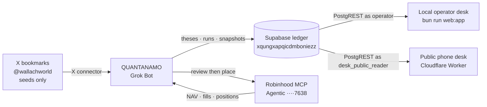
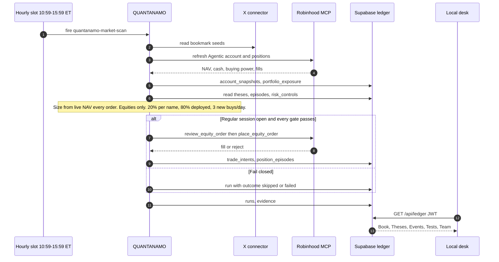

```
  ___  _   _    _    _   _ _____    _    _   _    _    __  __  ___
 / _ \| | | |  / \  | \ | |_   _|  / \  | \ | |  / \  |  \/  |/ _ \
| | | | | | | / _ \ |  \| | | |   / _ \ |  \| | / _ \ | |\/| | | | |
| |_| | |_| |/ ___ \| |\  | | |  / ___ \| |\  |/ ___ \| |  | | |_| |
 \__\_\\___//_/   \_\_| \_| |_| /_/   \_\_| \_/_/   \_\_|  |_|\___/
```

**QUANTANAMO** is a Grok Bot. It researches, sizes, and (when every gate passes) trades equities. Independent theses and the Agentic book live in Supabase. A localhost Bloomberg-style desk watches that ledger. X bookmarks are seeds, not the thesis store.

> Experimental software, not a promise of performance. It fails closed: missing evidence, stale broker state, a closed session, or a broken gate means **no order**. Never invent P/L on the desk — if the ledger has no mark, say so.

Operator how-to (auth, env, keyboard): [`LOCAL.md`](LOCAL.md).

## Keep this file current

This README is the living map of the **live** loop. When a PR adds or retires a routine, thesis family, desk panel, or trading limit, **edit the tables below in the same PR**. Do not leave Cloudflare / ThesisForge described as the brain.

| If you change… | Also update |
|---|---|
| A Grok Bot cadence | [Routines](#routines) and `apps/dashboard/lib/routines.ts` |
| A thesis family | [Theses](#theses) (ids from `public.theses`) |
| A desk tab | [Desk](#local-desk) and `apps/dashboard/lib/desk-nav.ts` |
| A live trading limit | [Trading](#trading) and `config/trade_policy.json` |

---

## System



| Piece | Role |
|---|---|
| **QUANTANAMO (Grok Bot)** | Research and trading brain. Writes the ledger. Places equities through Robinhood MCP when gates pass. |
| **Supabase** `xqungxapqicdmboniezz` | Canonical store: theses, runs, `account_snapshots`, `position_episodes`, `trade_intents`, `portfolio_exposure`, … |
| **Local desk** | `bun run web:app` / `bash scripts/web-app.sh`. Reads the ledger as the signed-in operator. Does not run the bot. |
| **Public phone desk** | Cloudflare Worker `grasshopper-desk`. Same Book/Theses/Events/Tests chrome. `GET /api/desk` is a live SELECT as `desk_public_reader`. No KV copy, no publish step, no Supabase keys in the browser. |
| **X connector** | Bookmark seeds from `@wallachworld`. Not the reconnect-OAuth path on the desk. |
| **Robinhood Agentic** | Live proof account, nickname **Agentic**, last4 **7638**. Official MCP only. |

ThesisForge cron and the `dashboard-publication` / `cloud-control` edge functions are **retired ingest**. The operator desk talks to PostgREST as the signed-in user. `workers/desk` is the public read-only phone site (live SELECT, KV cache). Other worker folders are not the live research/trading loop.

---

## Routines

Edit this table when a cadence is added, renamed, or retired. Last-run times on the desk come from `public.runs`, not a fake next-fire clock.

| Routine | Folder / id | When (America/New_York) | Writes |
|---|---|---|---|
| Market scan | `quantanamo-market-scan` | Weekdays hourly **10:59–15:59** | `runs` (`market_scan`), snapshots, theses/evidence, intents when gated |
| Missed-swing autopsy | `quantanamo-missed-swing-autopsy` | Weekdays **16:15** | `runs` (`missed_swing_autopsy`), lessons / earnings-gap notes |

A scan that cannot refresh the Agentic account, or that hits a closed session, fails closed and still records a run.

### Market-scan sequence



---

## Trading

Live book: **Agentic** proof account (last4 7638). Starting capital is the first Agentic `account_snapshots` row (~$5,000). Open names are **every lot** on the latest `portfolio_exposure` snapshot for that last4 (as of 2026-08-27: IREN, NBIS, CIFR, DG). The Book panel shows NAV, cash, and buying power from the matching `account_snapshots` row. Per-name mark is shown only if the ledger has it.

| Limit | Value | Note |
|---|---|---|
| Asset class | Equities only | No options, crypto, margin, or shorting |
| Per name | 20% of **live** NAV | Recalculate from the fresh Robinhood total every order |
| Deployed | 80% of live NAV | Remainder cash |
| New equity buys | 3 / day | Risk-reducing sells are a separate path |
| Session | US regular hours | No after-hours queue |
| Review | `review_equity_order` immediately before `place_equity_order` | Any broker check blocks |

Keep [`config/trade_policy.json`](config/trade_policy.json) aligned with this table when limits change.

---

## Theses

Independent of X. Source of truth: `public.theses` on `xqungxapqicdmboniezz`. Refresh this table when a family is added or killed.

| Id | Name | Status |
|---|---|---|
| `neocloud_compute` | Neocloud and GPU compute burst basket | hardening |
| `semis_photonics` | AI semiconductor and photonics second derivative | hardening |
| `ai_power_nuclear` | AI power bottleneck beneficiaries | hardening |
| `software_ai_apps` | AI software and developer tooling watchlist | hardening |
| `defense_drones_space` | Defense, drones, and space momentum basket | hardening |
| `quantum` | Quantum momentum burst basket | hardening |
| `biotech_royalty` | Biotech royalty asymmetric setup | hardening |
| `earnings_gap_structure` | Earnings gap structure and missed-swing autopsy | forming |
| `crypto` | Crypto and decentralized AI optionality | forming |

---

## Local desk

```sh
bun install
bun run web:app    # same as: bash scripts/web-app.sh
```

Open `http://localhost:5173`. Sign in with **email magic link** or a **passkey** (RP ID `localhost`). The publishable / anon key is the only Supabase key in the browser (`NEXT_PUBLIC_*`). `service_role` and `QUANTANAMO_DATABASE_URL` stay server-side. First confirmed user is claimed via `claim_ledger_operator`; later operators need a `public.ledger_operators` row. `anon` is revoked. The desk queries PostgREST as that JWT.

It does not ingest X, call Robinhood, or run Grok. `/api/x/authorize` is retired (410). The desk does not display retired worker caps (3 buys/day, 20% name, RTH 09:45–15:45); those contradict the live mandate. PLTR is a compliance skip, not a position.

| Key | Tab | Shows |
|---|---|---|
| 1 | Board | Landing (`/`). Desk-sport % lines via [Liveline](https://benji.org/liveline). QUANTANAMO / ODDSBORNE / BANDIT compete on **% vs each book’s own start** in native units (USD or SOL). ALL is a multi-series of those % curves — the only shared axis. No SOL→USD. Missing start is **not ranked**, not 0%. `/leaderboard` redirects here. See [`docs/liveline-pnl.md`](docs/liveline-pnl.md). |
| 2 | Book | `/book`. One holdings table of open and closed lots (Stocks / Predictions / Coins). Each row carries steward identity and a LIVE / CLOSED chip. Native units. Missing marks stay unmarked — never invented P/L. |
| 3 | Theses | Phone: parchment list of ledger theses (name, stance/status, confidence, domain/steward). Tap opens summary, falsifier, and related evidence — no Book/Board marks. Operator desk keeps the ledger table (lifecycle, evidence, held/candidate symbols, lessons). |
| 4 | Events | Dated catalysts and `pm_markets.close_time` on one sheet + `research_queue`. `/catalysts` redirects here. |
| 5 | Tests | Backtests from `strategy_tests` + `backtest_artifacts`. Equity curve and trades only when those artifacts exist. Prices from Financial Datasets. Missing artifact or null metric → **not in ledger**. |
| 6 | Team | Parchment steward cards from `desk_agents` (QUANTANAMO, ODDSBORNE, BANDIT, plus COINTANAMO if present). Circle+eyes face, name, domain, and pulse (heartbeat age). No win rate, hold, size, or NAV. Empty `desk_agents` is an honest empty. `/mates` redirects here. |

Last QUANTANAMO scan/autopsy is a chrome **chip** (from `public.runs` + `apps/dashboard/lib/routines.ts`), not a tab. Retired routes keep chrome mounted: `/leaderboard` and `/board` → `/`; `/risk` and `/runs` → `/book`; `/catalysts` → `/events`; `/ontology` and `/learnings` → `/theses`; `/mates` → `/team`. Risk controls stay in the database and are not a settings page.

Chrome stays mounted. Tab switches paint from the in-memory ledger payload. On the phone, Board / Book / Team are one swipe deck; the dock labels are a thin indicator, not a second nav. Theses is its own surface (`/theses`): a parchment card list, tap for the sentence and evidence. Keyboard: `1–6`, `g` then letter (`p/b/t/c/e/m`), `j/k` thesis, `r` refresh, `?` help. Venue chips (All / STOCKS / PREDICTIONS / COINS) filter Book, Theses, and Events — not a search box.

Canonical reads: `account_snapshots`, `portfolio_exposure` (latest last4 7638), `trade_intents`, `broker_fills`, `theses`, `thesis_symbols`, `trade_proposals`, `runs`, `strategy_tests`, `backtest_artifacts`, plus ODDSBORNE `pm_markets` / `pm_positions` / `pm_orders` / `pm_fills` / `pm_pnl` / `pm_notes` when those relations exist, plus BANDIT `meme_tokens` / `meme_positions` / `meme_orders` / `meme_fills` / `meme_pnl` / `meme_notes` when those relations exist, plus Team `desk_agents` / `desk_domains` / `desk_domain_stewards` / `desk_accounts` when those relations exist. Missing `pm_*`, `meme_*`, or `desk_*` tables yield an empty slice — the desk still loads. Not `dashboard_snapshots.current`. Equity book names come from the 7638 exposure snapshot, not `position_episodes`.

---

## Ledger

| Domain | Tables |
|---|---|
| Research | `theses`, `thesis_evidence`, `thesis_scores`, `catalysts`, `research_queue`, `research_lessons` |
| Book | `account_snapshots`, `position_episodes`, `portfolio_exposure`, `trade_intents`, `broker_fills` |
| Prediction | `pm_markets`, `pm_positions`, `pm_orders`, `pm_fills`, `pm_pnl`, `pm_notes` (ODDSBORNE / Polymarket; GRASSHOPPER) |
| Coins | `meme_tokens`, `meme_positions`, `meme_orders`, `meme_fills`, `meme_pnl`, `meme_notes` (BANDIT / Solana; `solana-bandit-primary`). Publisher role needs `quantanamo_worker_select` RLS, not just `GRANT SELECT` — same as `pm_*`. |
| Automation | `runs` (`notes.outcome` is `passed` \| `failed` \| `skipped` when JSON) |
| Tests | `research_cycles`, `strategy_tests`, `test_scenarios`, `backtest_artifacts` (Financial Datasets prices) |
| Team | `desk_domains`, `desk_agents`, `desk_domain_stewards`, `desk_accounts` (soft stewardship; public Worker SELECT as `desk_public_reader`) |
| Operators | `ledger_operators` + `is_ledger_operator()` (private DEFINER, public INVOKER wrapper) |

The desk is read-only. QUANTANAMO writes the ledger. See [`LOCAL.md`](LOCAL.md).

---

## Repository

```text
apps/dashboard/          local Next desk (PostgREST as operator; public mode via env)
config/trade_policy.json human-authored live limits (keep in sync with Trading)
docs/                    runbooks (some still describe retired Cloudflare ingest)
supabase/schemas/        declarative Postgres
supabase/migrations/     history
packages/                shared helpers
workers/desk             public phone desk (static assets + live /api/desk)
workers/                 retired Cloudflare ingest — not the live brain
```

---

## Public phone desk

The operator desk stays localhost-only (`bun run web:app`). The public site is the same desk (Board / Book / Theses / Events / Tests / Team) hosted on Cloudflare Workers static assets. Board and Book are Liveline-first. It never talks to PostgREST from the browser.

```
phone  →  Worker GET /api/desk  →  PostgREST as desk_public_reader (live ledger)
```

That is the only path. There is no KV snapshot, no `PUT /internal/snapshot`, and no last-good published copy.

### How the public Worker reads (no write credentials)

1. `GET /api/desk` always loads the same assembler as the operator desk (`loadDeskFromRest`) against Supabase PostgREST. Kong `apikey` is the **publishable/anon** key. `Authorization` is a JWT with `role=desk_public_reader` (SELECT-only RLS). `toPublicDeskSnapshot()` sets `source: 'snapshot'` (sanitized public envelope) and drops operator audit rows (`ontology_actions`).
2. HTTP `Cache-Control: no-store`. A failed live read is **503** `{ error: 'Desk ledger unavailable' }` — never yesterday’s copy.
3. `PUT /internal/snapshot` is gone (405). The public SPA only fetches `/api/desk`. There are no write routes, no auth, no admin chrome, and no `NEXT_PUBLIC_SUPABASE_*` in the public build.

**Show-me — role and tables.** Role `desk_public_reader` (`nologin`, granted to `authenticator`). `GRANT SELECT` + policy `desk_public_reader_select` on: `theses`, `thesis_symbols`, `thesis_evidence`, `thesis_scores`, `thesis_relations`, `runs`, `cloud_runs`, `cloud_tasks`, `codex_automations`, `catalysts`, `research_queue`, `research_lessons`, `postmortems`, `research_cycles`, `strategy_tests`, `test_scenarios`, `backtest_artifacts`, `agent_runs`, `account_snapshots`, `position_episodes`, `portfolio_exposure`, `trade_intents`, `trade_proposals`, `broker_fills`, `insights`, `predictions`, `risk_controls`, `ontology_themes`, `symbols`, `ontology_candidates`, `ontology_management_actions`, ODDSBORNE `pm_*`, BANDIT `meme_*`, Team `desk_agents` / `desk_domains` / `desk_domain_stewards` / `desk_accounts`. No INSERT/UPDATE/DELETE. No `dashboard_snapshots`. `anon` stays revoked on live tables. Never put `service_role` or `QUANTANAMO_DATABASE_URL` on this Worker.

`pm_*` and `meme_*` rows map into the **same** Book / Theses / Events language as equities. Empty tables stay empty; no invented P/L. New domain lanes need `desk_public_reader_select` RLS (`using (true)`) in addition to `quantanamo_worker_select` for QUANTANAMO.

### Deploy

Push to `main` (or **Actions → Deploy public desk → Run workflow**) runs `.github/workflows/deploy-public-desk.yml`: `desk:build` then `wrangler-action deploy`. That is the same Cloudflare path that shipped before #39. It needs only:

| Secret | Value |
|---|---|
| `CLOUDFLARE_API_TOKEN` | Cloudflare API token with **Edit Cloudflare Workers** |
| `CLOUDFLARE_ACCOUNT_ID` | `97af2e2312077d4689e9a012ef5dde75` |

Reader credentials are Worker `vars` (publishable apikey + `role=desk_public_reader` JWT claim). Live PostgREST SELECTs go through the GET-only `desk-public-rest` function so merge does not wait on a JWT secret in Actions. There is no publish command and no KV.

The Worker is `grasshopper-desk` on `*.workers.dev` until a custom domain is attached. No sign-in on the public URL. Face ID / passkey stays on `bun run web:app` only. Local Worker preview: `bun run desk:build && bun run desk:dev` (port 8787) with `workers/desk/.dev.vars`.

### Local operator vs public

| | Operator (`bun run web:app`) | Public (`NEXT_PUBLIC_DESK_MODE=public` or the Worker) |
|---|---|---|
| Auth | Magic link / passkey; `ledger_operators` RLS | None. Worker reads as `desk_public_reader`. |
| Data | `/api/ledger` as the signed-in JWT (or postgres.js server-side) | `/api/desk` live PostgREST only |
| Keys | `NEXT_PUBLIC_SUPABASE_PUBLISHABLE_KEY` in the browser | No Supabase keys in the SPA. Reader JWT is a Worker secret. |
| Writes | Retired 410s | 405 / 404 |
| Chrome | Sign out / Passkey+ | Hidden |

Local public preview (same Next app, no Cloudflare):

```sh
bun run web:public            # http://localhost:5173 — GET /api/desk (live postgres)
```

Env (see `.env.example`; never commit secrets):

| Var | Where | Purpose |
|---|---|---|
| `NEXT_PUBLIC_DESK_MODE=public` | Public client / `web:public` | Skip operator auth |
| `NEXT_PUBLIC_DESK_URL` | Public metadata | Canonical public origin |
| `QUANTANAMO_DATABASE_URL` | Local `/api/desk` | Assemble the live desk (postgres.js). Not on the Worker. |
| `DESK_READER_APIKEY` | Worker var | Publishable/anon key for Kong. Not in the SPA. |
| `DESK_READER_JWT` | Worker var | JWT claim `role=desk_public_reader`. |

Keep writing `pm_*` — do not add a second public app. The public URL has no sign-in; Face ID / passkey stays on the local operator desk.

```sh
bun run --cwd apps/dashboard test
bun test
```

Never commit `.env.local`, `.dev.vars`, OAuth tokens, or `service_role` keys.

## Further reading

- [`LOCAL.md`](LOCAL.md) — sign-in, env, how to confirm you are on the live ledger
- [`config/trade_policy.json`](config/trade_policy.json) — execution contract
- [`docs/live-trading-checklist.md`](docs/live-trading-checklist.md) — pre-trade gates
