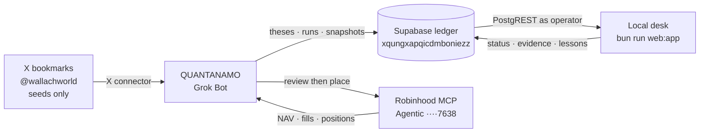
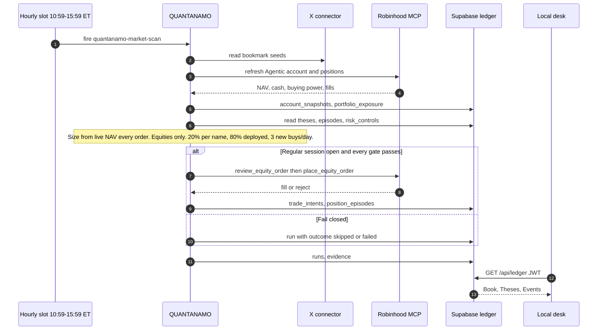

```
  ___  _   _    _    _   _ _____    _    _   _    _    __  __  ___
 / _ \| | | |  / \  | \ | |_   _|  / \  | \ | |  / \  |  \/  |/ _ \
| | | | | | | / _ \ |  \| | | |   / _ \ |  \| | / _ \ | |\/| | | | |
| |_| | |_| |/ ___ \| |\  | | |  / ___ \| |\  |/ ___ \| |  | | |_| |
 \__\_\\___//_/   \_\_| \_| |_| /_/   \_\_| \_/_/   \_\_|  |_|\___/
```

**QUANTANAMO** is a Grok Bot. It researches, sizes, and (when every gate passes) trades equities. Independent theses and the Agentic book live in Supabase. A localhost Bloomberg-style desk watches that ledger. X bookmarks are seeds, not the thesis store.

> Experimental software, not a promise of performance. It fails closed: missing evidence, stale broker state, a closed session, or a broken gate means **no order**. Never invent P/L on the desk — if the ledger has no mark, say so.

Operator how-to (auth, env, keyboard): [`LOCAL.md`](LOCAL.md).

## Keep this file current

This README is the living map of the **live** loop. When a PR adds or retires a routine, thesis family, desk panel, or trading limit, **edit the tables below in the same PR**. Do not leave Cloudflare / ThesisForge described as the brain.

| If you change… | Also update |
|---|---|
| A Grok Bot cadence | [Routines](#routines) and `apps/dashboard/lib/routines.ts` |
| A thesis family | [Theses](#theses) (ids from `public.theses`) |
| A desk tab | [Desk](#local-desk) and `apps/dashboard/lib/desk-nav.ts` |
| A live trading limit | [Trading](#trading) and `config/trade_policy.json` |

---

## System



| Piece | Role |
|---|---|
| **QUANTANAMO (Grok Bot)** | Research and trading brain. Writes the ledger. Places equities through Robinhood MCP when gates pass. |
| **Supabase** `xqungxapqicdmboniezz` | Canonical store: theses, runs, `account_snapshots`, `position_episodes`, `trade_intents`, `portfolio_exposure`, … |
| **Local desk** | `bun run web:app` / `bash scripts/web-app.sh`. Reads the ledger as the signed-in operator. Does not run the bot. |
| **X connector** | Bookmark seeds from `@wallachworld`. Not the reconnect-OAuth path on the desk. |
| **Robinhood Agentic** | Live proof account, nickname **Agentic**, last4 **7638**. Official MCP only. |

Cloudflare workers, ThesisForge cron, and the `dashboard-publication` / `cloud-control` edge functions are **retired ingest**. The desk talks to PostgREST as the signed-in operator. Worker folders may still exist in the repo; they are not the live loop.

---

## Routines

Edit this table when a cadence is added, renamed, or retired. Last-run times on the desk come from `public.runs`, not a fake next-fire clock.

| Routine | Folder / id | When (America/New_York) | Writes |
|---|---|---|---|
| Market scan | `quantanamo-market-scan` | Weekdays hourly **10:59–15:59** | `runs` (`market_scan`), snapshots, theses/evidence, intents when gated |
| Missed-swing autopsy | `quantanamo-missed-swing-autopsy` | Weekdays **16:15** | `runs` (`missed_swing_autopsy`), lessons / earnings-gap notes |

A scan that cannot refresh the Agentic account, or that hits a closed session, fails closed and still records a run.

### Market-scan sequence



---

## Trading

Live book: **Agentic** proof account (last4 7638). Starting capital is the first Agentic `account_snapshots` row (~$5,000). Open names are **every lot** on the latest `portfolio_exposure` snapshot for that last4 (as of 2026-08-27: IREN, NBIS, CIFR, DG). The Book panel shows NAV, cash, and buying power from the matching `account_snapshots` row. Per-name mark is shown only if the ledger has it.

| Limit | Value | Note |
|---|---|---|
| Asset class | Equities only | No options, crypto, margin, or shorting |
| Per name | 20% of **live** NAV | Recalculate from the fresh Robinhood total every order |
| Deployed | 80% of live NAV | Remainder cash |
| New equity buys | 3 / day | Risk-reducing sells are a separate path |
| Session | US regular hours | No after-hours queue |
| Review | `review_equity_order` immediately before `place_equity_order` | Any broker check blocks |

Keep [`config/trade_policy.json`](config/trade_policy.json) aligned with this table when limits change.

---

## Theses

Independent of X. Source of truth: `public.theses` on `xqungxapqicdmboniezz`. Refresh this table when a family is added or killed.

| Id | Name | Status |
|---|---|---|
| `neocloud_compute` | Neocloud and GPU compute burst basket | hardening |
| `semis_photonics` | AI semiconductor and photonics second derivative | hardening |
| `ai_power_nuclear` | AI power bottleneck beneficiaries | hardening |
| `software_ai_apps` | AI software and developer tooling watchlist | hardening |
| `defense_drones_space` | Defense, drones, and space momentum basket | hardening |
| `quantum` | Quantum momentum burst basket | hardening |
| `biotech_royalty` | Biotech royalty asymmetric setup | hardening |
| `earnings_gap_structure` | Earnings gap structure and missed-swing autopsy | forming |
| `crypto` | Crypto and decentralized AI optionality | forming |

---

## Local desk

```sh
bun install
bun run web:app    # same as: bash scripts/web-app.sh
```

Open `http://localhost:5173`. Sign in with **email magic link** or a **passkey** (RP ID `localhost`). The publishable / anon key is the only Supabase key in the browser (`NEXT_PUBLIC_*`). `service_role` and `QUANTANAMO_DATABASE_URL` stay server-side. First confirmed user is claimed via `claim_ledger_operator`; later operators need a `public.ledger_operators` row. `anon` is revoked. The desk queries PostgREST as that JWT.

It does not ingest X, call Robinhood, or run Grok. `/api/x/authorize` is retired (410). The desk does not display retired worker caps (3 buys/day, 20% name, RTH 09:45–15:45); those contradict the live mandate. PLTR is a compliance skip, not a position.

| Key | Tab | Shows |
|---|---|---|
| 1 | Book | Landing (`/`). Agentic last4 7638 NAV / cash / lots from the latest `portfolio_exposure` snapshot plus the matching `account_snapshots` row. Fill tape. Next dated catalyst on held names. Thesis lots with ledger P/L (or **not in ledger**). Living diagnostic beside/above the table: lot tiles (inner plate sized by notional, Δ only when marked) + interpolating NAV path from Agentic snapshots. Table stays canonical; unmarked lots are muted, never a fake P/L color. |
| 2 | Theses | Lifecycle + evidence + held/candidate symbols (ontology folded in) + lessons pane |
| 3 | Events | Catalysts + `research_queue` (pre-event sheet; not AI-filtered). `/catalysts` redirects here. |
| 4 | Tests | Backtests from `strategy_tests` + `backtest_artifacts`. Equity curve and trades only when those artifacts exist. Prices from Financial Datasets. Missing artifact or null metric → **not in ledger**. |

Last QUANTANAMO scan/autopsy is a chrome **chip** (from `public.runs` + `apps/dashboard/lib/routines.ts`), not a tab. Retired routes keep chrome mounted: `/book` and `/risk` and `/runs` → `/`; `/catalysts` → `/events`; `/ontology` and `/learnings` → `/theses`. Risk controls stay in the database and are not a settings page.

Chrome stays mounted. Tab switches paint from the in-memory ledger payload. Keyboard: `1–4`, `g` then letter (`b/t/c/e`), `j/k` thesis, `r` refresh, `?` help. No filter box.

Canonical reads: `account_snapshots`, `portfolio_exposure` (latest last4 7638), `trade_intents`, `broker_fills`, `theses`, `thesis_symbols`, `trade_proposals`, `runs`, `strategy_tests`, `backtest_artifacts`. Not `dashboard_snapshots.current`. Book names come from that exposure snapshot, not `position_episodes`.

---

## Ledger

| Domain | Tables |
|---|---|
| Research | `theses`, `thesis_evidence`, `thesis_scores`, `catalysts`, `research_queue`, `research_lessons` |
| Book | `account_snapshots`, `position_episodes`, `portfolio_exposure`, `trade_intents`, `broker_fills` |
| Automation | `runs` (`notes.outcome` is `passed` \| `failed` \| `skipped` when JSON) |
| Tests | `research_cycles`, `strategy_tests`, `test_scenarios`, `backtest_artifacts` (Financial Datasets prices) |
| Operators | `ledger_operators` + `is_ledger_operator()` (private DEFINER, public INVOKER wrapper) |

The desk is read-only. QUANTANAMO writes the ledger. See [`LOCAL.md`](LOCAL.md).

---

## Repository

```text
apps/dashboard/          local Next desk (PostgREST as operator)
config/trade_policy.json human-authored live limits (keep in sync with Trading)
docs/                    runbooks (some still describe retired Cloudflare ingest)
supabase/schemas/        declarative Postgres
supabase/migrations/     history
packages/                shared helpers
workers/                 retired Cloudflare ingest — not the live brain
```

```sh
bun run --cwd apps/dashboard test
bun test
```

Never commit `.env.local`, `.dev.vars`, OAuth tokens, or `service_role` keys.

## Further reading

- [`LOCAL.md`](LOCAL.md) — sign-in, env, how to confirm you are on the live ledger
- [`config/trade_policy.json`](config/trade_policy.json) — execution contract
- [`docs/live-trading-checklist.md`](docs/live-trading-checklist.md) — pre-trade gates
